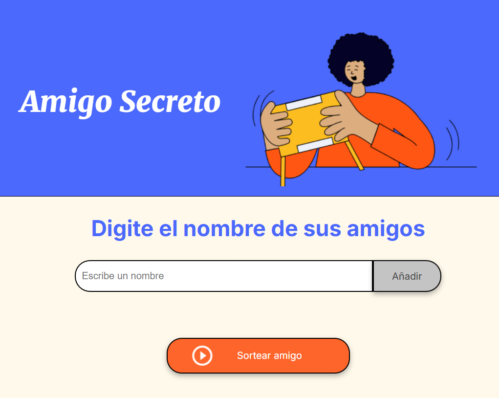

<iframe width="640" height="360" src="https://www.loom.com/embed/458e4167dac547f994ba1f1e314810b3?sid=7ae1ae01-2d2d-4348-8d85-8723568af7a4" frameborder="0" webkitallowfullscreen mozallowfullscreen allowfullscreen></iframe>

# Amigo Secreto

Esta es una primera versión  del juego Amigo Secreto. 
La aplicación entrega de manera sencilla e interactiva, el nombre de una persona mediante el sorteo de una lista de amigos, familiares, compañeros o quienes decidan jugarlo.

## Características

<li>Permite ingresar una nómina de los participantes, realizando las validaciones correspondientes</li>
<li>El sorteo se genera de manera aleatoria entre los participantes</li>
<li>La interfaz del juego lo hace simple e intuitivo</li>
<li>Los mensajes al usuario, le permiten orientar en el uso y práctica del juego</li>

## Requisitos

Para jugar el juego, sólo necesitas un Navegador web moderno (Edge, Brave, Google Chrome, Firefox, etc.)


## Estructura del Proyecto

```plaintext
/
├── index.html       # Archivo HTML principal
├── style.css        # Estilos del proyecto
├── app.js           # Lógica de la aplicación
├── assets/          # Carpeta con imágenes e íconos
└── README.md        # Documentación del proyecto


```
## Instalación

Instrucciones para instalar el proyecto en el entorno local:

1. Clona el repositorio:

   - git clone https://github.com/Olguitis/juego-secreto.git
